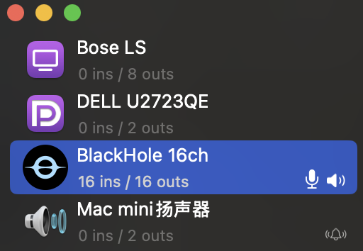

# 🎧 FixCenterLFE

**FixCenterLFE** is a lightweight macOS tool that intercepts multi-channel audio in real time and fixes incorrect channel mapping between the **Center** and **LFE (Subwoofer)** channels — a common issue (with your surround sourd system) when running Windows games via **Crossover** or **Wine**.

> ✅ Fixes voice/dialog audio being incorrectly routed to the subwoofer  
> ✅ Works in real-time with low latency using [BlackHole](https://github.com/ExistentialAudio/BlackHole)  
---

## 🎮 Supported Games

- Black Myth: Wukong (黑神话悟空)
- Split Fiction (双影奇境)
- Other Wine/Crossover games with center/LFE channel issues under the surround sourd system
---

## 🔍 Problem

Many Wine-based Windows games assume Windows-style surround sound mapping. On macOS, when using HDMI or multichannel audio devices, the **Center** and **LFE** channels are often flipped. This causes:

- Game narration or voice dialog routed to the subwoofer
- Movies sounding fine, but Wine apps sounding wrong
- No easy way to remap audio channels globally

---

## 🎯 Solution

**FixCenterLFE** sits between the system audio output and your real audio hardware, capturing audio in real time, **swapping channel 3 (Center) and channel 4 (LFE)**, and passing the corrected signal to your speakers.

### 🧭 Signal Flow

```text
          ┌──────────────┐
          │ macOS System │
          │ (Wine/Crossover Game) 
          └──────┬───────┘
                 │
          [Multichannel Audio]
                 │
          ▼ BlackHole (Virtual Output)
┌────────────────────────────────────┐
│          FixCenterLFE              │
│  (Python or Native Audio Processor)│
│       ⟶ Swap Channel 3 & 4         │
└────────────┬───────────────────────┘
             │
      [Corrected Multichannel Audio]
             │
      ▼ Real Output Device (e.g. HDMI, Headphones)
```
## ⚙️ Installation

### Prerequisites
- Python 3.9.6+
- [BlackHole](https://github.com/ExistentialAudio/BlackHole) virtual audio driver
  - 16ch: `brew install blackhole-16ch`
  - 64ch: `brew install blackhole-64ch`
  - Try this to restart CoreAudio: `sudo killall -9 coreaudiod`
  - ⚠️ In MacOS "Audio MIDI Setup", set the default audio output device to this device
  - 
- [PortAudio](https://github.com/PortAudio/portaudio)
  - Install it via Homebrew: `brew install portaudio`

### Setup
1. Clone the repository:
   ```bash
   git clone https://github.com/yourusername/FixCenterLFE.git
   cd FixCenterLFE
   ```

2. Install Python dependencies:
   ```bash
   pip install -r requirements.txt
   ```

3. Run the application:
   ```bash
   python menu_app.py
   ```
## 🤝 Contributing

PRs are welcome!
Please include:
- Description of changes
- Testing details
- Screenshots if applicable

## 🧪 Testing
Verified working with:
- [x] Black Myth: Wukong
- [x] Split Fiction
- [ ] Other games (please report your tests!)
